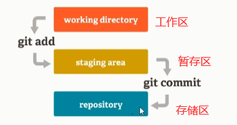

# Git课程笔记

## IDEA集成GitHub

## 版本号

### 介绍

git的版本号是通过SHA-1加密算法计算出来的，共有40位

定位仓库中的文件：2(用于标识文件位置)+38(标识文件名)

### 查看文件

### 分支操作

HEAD文件中指向当前的分支，当前分支指向最后一次提交的版本号

## Git命令

### 介绍

### 仓库操作

- 查看git版本
  - git -v
- 初始化本地仓库
  - git init
- 克隆远程仓库
  - git clone [http路径] [名称(可选)]
- 配置仓库
  - git config [配置名称] [配置的值]
    - user.name   用户名
    - user.email  用户邮箱
  - 或者修改config文件
  - 添加全局配置
    - git config --global [配置名称] [配置的值]

### 文件操作

- 查看状态
  
  - git status
- 添加文件到暂存区
  - git add [文件名]
- 删除文件——其实是将文件从暂存区放回工作区
  - git rm --cached [文件名]
- 提交
  - git commit -m [提交信息]
- 历史记录
  - git log  [--oneline 显示为一行]
    - [版本号/标签]   显示之前提交的历史
- 误删除处理
  - 未提交
    - git restore [文件名]
  - 已提交
    - git reset -hard [版本名称]    重置版本，但会丢失提交操作
    - git revert [版本名称(当前已提交版本)]  恢复到提交前的状态且不丢失提交操作记录。

### 分支操作

- 创建新分支
  - git branch [分支名称]
    - 需要先提交一次
- 查看分支
  - git branch -v
- 切换分支
  - git checkout [分支名称]
  - git checkout -b [分支名称]  创建并切换分支
- 删除分支
  - git branch -d [分支名称]
- 分支合并
  - git merge [分支名称]
  - 如果发生冲突
    - 手动更改发生冲突的文件的内容
    - 提交更改后的文件

### 标签指令

- 添加标签
  - git tag [标签内容] [版本号]
    - 标签不能重复
- 删除标签
  - git tag -d [标签名称]

### 远程仓库

- 配置远程仓库
  - git remote add [远程仓库地址标签] [仓库地址]
  - 修改config文件中的url
- 添加远程仓库
  - git remote add [远程仓库地址标签] [仓库地址]

- 删除远程仓库
  - git remote remove  [远程仓库地址标签]

- 重命名远程仓库
  - git remote rename 
- 提交到远程仓库
  - git push [远程仓库地址标签]
- 从远程仓库拉取数据
  - git pull [远程仓库地址标签]