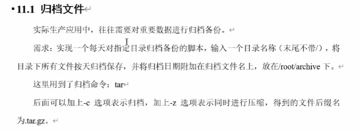

## Linux脚本综合案例

### 文件归档



```linux
#!/bin/bash

# 判断输入参数是否正确，个数是否为1
if [ $# -ne 1 ]
then
        echo "参数个数错误，应该输入一个参数作为归档的目录名。"
        exit
fi

# 获取当前输入的目录名称
if [ -d $1 ]
then
        echo
else
        echo
        echo "目录不存在！"
        exit
fi

DIR_NAME=$(basename $1)
DIR_PATH=$(cd $(dirname $1);pwd)

# 获取当前日期
DATE=$(date +%y%m%d)

# 定义生成的归档文件名称
FILE=archive_${DIR_NAME}_$DATE.tar.gz

DEST=/root/archive/$FILE

# 开始归档目录文件
echo "开始归档"
echo
tar -czf $DEST $DIR_PATH/$DIR_NAME

if [ $? -eq  0 ]
then
        echo
        echo "归档成功！"
        echo "归档文件为：$DEST"
        echo
else
        echo "归档出现问题！"
fi

exit

```

### 发送消息


```linux
#!/bin/bash

# 查看用户是否登录
login_user=$(who | grep -i -m 1 $1 | awk '{print $1}')

if [ -z $login_user ]
then 
        echo "$1不在线！"
        echo "脚本退出"
        exit
fi

# 查看用户是否开启消息功能
is_allowed=$(who -T | grep -i -m 1 $1 | awk '{print $2}')

if [ $is_allowed != "+" ]
then 
        echo "$1没有开启消息功能"
        echo "脚本退出"
        exit
fi

# 确认是否有消息发送
if [ -z $2 ]
then
        echo "没有消息发送"
        echo "脚本退出.."
        exit
fi

# 从参数中获取要发送的消息
whole_msg=$(echo $* | cut -d " " -f 2-)

# 获取当前用户的终端
user_terminal=$(who | grep -i -m 1 $1 | awk '{print $2}')

# 写入要发送的消息
echo $whole_msg | write $login_user $user_terminal

if [ $?!=0 ]
then
        echo "发送失败！"
else
        echo "发送成功！"
fi

exit

```

