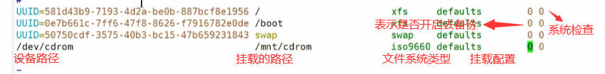

# Linux课程笔记

### 一、Linux基础

#### Linux文件系统及目录结构

Linux是层级式目录结构

- / Linux根目录。
- /bin 二进制命令目录，存放着直接可以执行的常用命令。如cd、ls等。本身是一个软链接，实际指向/usr/bin。
- /sbin 系统级的二进制命令，存放着su能使用的命令。链接到/usr/sbin 。
- /lib 库目录，存放系统和应用程序需要使用的库文件。等同于Windows中的system32的dll文件。链接到/usr/lib。
- /lib64 64位的库文件。链接到/usr/lib64。
- /usr 用户目录。存放应用程序和用户相关的文件。
- /boot 存放引导启动有关的文件。
- /dev 设备目录。
- /etc 存放系统管理需要的配置文件。
- /home 每个用户都有的主目录，放置普通用户的个性化文件。root用户存放在/root中。
- /root root用户的主目录。
- /opt 可选目录，给第三方软件包专门留下的目录。
- /media 识别一些可移动媒体设备，linux会把u盘、光驱等外部设备挂载到media中。
- /mnt 类似于media，另外一个挂载点。
- /proc 现有的硬件和进程信息。
- /run 运行目录，存放当前系统运行以来的所有临时信息。
- /srv 跟系统服务相关。
- /sys 系统硬件信息相关文件。
- /tmp 临时目录，存放临时存放的东西。
- /var 存放一些经常被修改的东西，比如一些日志。

#### Vim编辑器

vim是一个通用的文本编辑器。

vim可以主动以字体颜色辨别语法的正确性，方便程序设计。vim与vi编辑器完全兼容。

vim编辑器的三种不同模式

- 一般模式\普通模式
  - yy 复制当前行
    - 数字 + yy	复制n行
    - y + $    复制从当前光标到行尾
    - y + ^    复制从行首到当前光标
    - y + w    复制当前单词
  - p 粘贴
    - 数字 + p	粘贴n行
  - dd 删除当前行
    - 数字 + dd	删除n行
    - d + $    删除从当前光标到行尾
    - d + ^    删除从行首到当前光标
    - d + w   删除当前单词
  - u 撤销操作
  - x 剪切当前光标位置，从前往后剪切，类似delete
  - X 剪切当前光标位置，从后往前剪切，类似于backspace
  - r + 需要更改的字符 更改当前光标位置的字符。
  - R + 需要更改的字符 更改当前行从光标位置到行尾的字符
  - ^ 移动到行首
  - $ 移动到行尾
  - w 移动到下一个词的词头
  - e  移动到当前词的词尾
  - b 移动到上一个词的词头
  - gg/H 移动到文档头
  - G/L 移动到文档尾
  - 数字 + G    跳转到第n行的行头
- 编辑模式
  - i  在当前光标前插入内容
  - a  在当前光标的后一位插入内容
  - o  在下方的新行插入内容
  - I   在当前行的行头插入内容
  - A  在当前行的行尾插入内容
  - O  在上方的新行插入内容
- 命令模式
  - :w 写入
  - :q 退出
  - :q! 强制退出
  - :set nu列出行号    set nonu 取消列出行号
  - / + 字符   查找包含当前字符的内容
    - n  切换下一个
    - N  切换上一个
  - :noh  取消高亮显示
  - :s/被替换的词/替换的词   替换当前光标所在行第一个查找到的词
    - s/被替换的词/替换的词/g  替换当前行的所有查找到的词
    - %s/被替换的词/替换的词  替换每一行的第一个查找到的词
    - %s/被替换的词/替换的词/g  替换整篇文档所有查找到的词

#### 网络配置和系统管理

##### Vmware三种网络连接模式

- 桥接模式
  - 虚拟机直接连接外部物理网络的模式，主机起到网桥的作用。在这种模式下，虚拟机可以直接访问外部网络，并且对外部网络是可见的。
- NAT模式
  - 虚拟机和主机构建一个专用网络，通过虚拟网络地址转换设备对Ip进行转换。 虚拟机通过共享主机IP可以访问外部网络，但外部网络无法访问虚拟机。
- 仅主机模式
  - 虚拟机与主机共享一个专用网络，与外部网络无法通信。

##### ifconfig命令

​	显示当前网络的信息

##### ping命令——测试网络联通情况

​	ping + ip地址

##### 修改虚拟机静态ip

​	进入/etc/sysconfig/network-scripts/

​	修改ifcfg-XXXX文件中的内容，并重启网络。

##### 修改主机名

	- 修改/etc/hostname	并重启
	- hostnamectl set-hostname [hostname]

##### 主机映射

​	修改/etc/hosts，添加ip + 主机名

​	修改本机windows/System32/drivers/etc文件 同样添加ip+主机名

##### 远程登录ssh

windows登录linux：[登录用户]@[ip或主机映射]	 并输入密码

	- 使用exit退出

##### Linux的进程和服务

- 计算机中，一个正在执行的程序或命令，叫做进程（process）。
- 启动后一直存在，常驻内存的进程，一般称作服务（service）。

##### service服务管理

- 基本语法：service [服务名] [start/restart/stop/status]	(centos6)
- 基本语法：systemctl [start/restart/stop/status] [服务名]   (centos7)
- 查看服务：/etc/init.id/[服务名]  (centos6)
- 查看服务：/usr/lib/systemd/[服务名] (centos7)

##### 配置开机自启动

 - setup	以图形化界面配置自启动

 - Centos6：

    - chkconfig --list	查看所有服务

      

    - chkconfig 服务名 off    关闭服务

    - chkconfig 服务名 on    开启服务

    - chkconfig  --level 启动级别 + on/off    开启或关闭指定级别的服务

- Centos7：

  - systemctl list-unit-files    查看所有服务
  - systemctl disable 服务名    关闭服务
  - systemctl enable 服务名    开启服务

##### Linux运行级别

- Centos6

- Centos7

- 查看运行级别

  systemctl get-default

- 设置运行级别

  init + 数字

##### 关机重启命令

- shutdown    默认一分钟后关机

  - shutdown -c    取消关机操作
  - shutdown -now   立刻关机
  - shutdown 数字    n分钟后关机
  - shutdown 时间{ex:15:28}   15时28分关机
  - shutdown -H 相当于halt
  - shutdown [-h|-P] 相当于poweroff
  - shutdown -r 相当于reboot

  关机前linux会使用sync将数据从内存同步到硬盘中(由于linux为了加快读写速度，会将一部分数据放在内存中。)

- halt    停机，关闭系统，但不断电    内存中的数据不丢失

- poweroff    断电，关机

- reboot    重启

### 二、Linux实操

#### Linux常用基本命令

##### 帮助命令

- man [命令或配置文件]	获取帮助信息
  - 内置命令需要加 -f
- help [命令] 获取内置命令的帮助信息
  - 内置命令：一部分基础功能的系统命令是直接内嵌在shell中的，系统加载启动之后会随着shell一起加载，常驻系统内存中。这部分命令称为内置命令。相应的其它命令称为外部命令。
  - 查看是否内置 type [命令]
- 命令 --help    获取命令内置帮助信息

##### 常用快捷键

##### 文件目录类命令

- pwd	显示当前工作目录的绝对路径
  - -P  显示软链接链接对应的实际物理路径
- ls    列出当前目录下的所有内容
  - -a   列出包括隐藏文件的所有文件
  - -l    列出长数据串  包含文件的属性和权限信息等
  - -i    查看文件索引号
  - -h  以kb/mb的单位查看文件大小(需要配合l一起使用)
- ll    是ls -l的别名，就相当于ls -l
- tree 将目录以目录树的方式展示
  - 没有需要用yum安装
- mkdir [文件夹名]    创建文件夹
  - -p   创建嵌套目录
- rmdir [文件夹名]    删除文件夹
  - -p    删除嵌套目录
- touch [文件名]    创建空文件
- cp  [源文件] [目标文件]
  - \cp	直接覆盖文件    \代表原生命令（cp为cp -i的别名）
  - -r    递归的复制整个文件夹
  - -P  进入软链接对应的实际物理路径
- alias    查看所有命令的别名
- rm [文件]
  - -r    递归删除
  - -f    强制删除不提示
  - -v    显示指令执行的详细过程
- mv [要移动的文件]  [移动的位置]
- cat [文件]
  - -n    显示所有行的行号，包括空行
- more [文件]     以全屏幕方式按页使用文件内容
  - 
- less [文件]   分屏显示文件内容，比more更强大，动态加载，不是一次性加载，用来打开大文件。快捷键同more
  - 快捷键G    跳到结尾
  - 快捷键g     跳到开头
  - /    搜索关键字
- echo    [输出内容]    输出内容到控制台
  - -e    支持反斜线控制的转义字符
- \>  输出重定向和 >> 追加
  - \> 将输出内容追加到文件中 {ex ls -l > a.txt}
  - \>>将输出内容追加到文件中 {ex ls -l > a.txt}
- head    显示当前文件开头的内容，默认为前10行。
  - -n 数字    指定显示前多少行
- tail    显示末尾的内容，默认10行
  - -n  数字    指定显示后多少行
  - -f  实时追踪该文档的所有更新
    - ctrl + s  暂时停止监控
    - ctrl + q  继续监控
    - ctrl + c  退出
- ln 软链接，也叫符号链接，类似于windows快捷方式，有自己的数据块，主要存放了链接其它文件的路径。在不加s的情况下是硬链接，即使删除源文件也能直接访问文件，但只能对文件创建链接，不能对路径创建链接。
  - -s [文件或者目录] [软连接名]  给原文件创建一个软链接。
  - 注意：在使用rm -rf删除时，一定注意[软链接名 /]会导致软链接对应的文件目录中的内容被删除！！！
- history    查看历史用过的命令
  - 数字  显示刚刚用过的n条命令
  - [没有history前缀] ! + 命令编号  执行对应编号的命令
  - -c   清空过去所有命令的历史

##### 时间日期类命令

- date  获取当前的日期时间信息
  - +%Y  显示年份
  - +%m  月份
  - +%d  天数
  - +%H  小时
  - +%M  分钟
  - +%S  秒
  - +%Y-%m-%d-%H:%M:%S  可以用这样的方式格式化展示时间，如果需要用空格分割，需要加引号。
  - +%s  当前秒数的时间戳
    - 时间戳：UTC1970.1.1开始到当前的秒的记数
  - -d "1 days ago"  昨天的日期
  - -d "-1 days ago"  明天的日期
  - -d "1 hours ago"  上一小时的日期
  - -s [字符串时间] 例如："2017-06-19 20:53:18"  设置系统时间
- ntpdate  [同步时钟服务器名称]   同步时间
- cal 查看日历
  - -数字  查看近n月日期
  - -m 使周一在最前显示
  - -年份  显示某年份的日历信息
  - -y  查看本年全年度的日历信息

##### 用户管理命令

- useradd 添加新用户

  - 用户名	添加新用户
  - -d  [主目录位置/名称] [用户名]    添加时设置主目录名称  
  - -g 组名 用户名    添加新用户到某个组

- passwd 设置密码

  - 用户名    设置用户的密码

- id 显示用户信息

  - 用户名    显示某个用户的信息
  - cat /etc/passwd  查看创建了哪些用户

- su  切换用户

  - 用户名   切换为某个用户

- who  查看用户的身份

  - am i  查看当前用户的身份——原始登录者身份
  - ami  查看当前用户的身份——目前使用者身份

- sudo  使普通用户具有临时root权限

  - [命令]   以root权限执行

  如何把普通用户添加到sudoers文件中：

   1. 修改 /etc/sudoers

   2. 在root ALL=(ALL)  ALL下将用户添加进去

      

   3. 或者将用户添加到%whell组中

- userdel [用户]  删除用户
  
  - -r  删除时同时删掉用户主目录
- usermod  修改用户的相关属性
  
  - -g [组名]    修改用户的组

##### 用户组管理命令

​	每个用户都有一个用户组，系统可以对一个用户组中的所有用户进行集中管理。

​	一个用户可以拥有多个组

​	组的信息在/etc/group中

- gourpadd [组名] 新建一个组
- groupmod 修改组信息
  - -n [新名字] [原名]   替换组名
- groupdel  [组名]    删除组

##### 文件权限及权限管理命令

如果没有权限，就会用[-]表示。文件类型包括[-]普通文件，[d]文件夹，[l]链接，[c]字符类型的设备文件，[b]块设备文件。

- chmod  改变权限
  
  - [u|g|o|a] [+|-|=] [r|w|x]
    - 其中a表示all，更改全部权限
  - [数字]
    - 三位表示二进制位，分别为4 2 1   例如rwx=7
    - 使用时输入三个数字，设置权限    例如777代表全部赋予rwx
  - -R  递归赋予权限
- chown  改变所有者
  - [最终用户] [文件]
  - -R 递归更改
- chgrp  更改所有组——需要root权限
  - [最终组] [文件]

##### 搜索查找类

- find    查找文件或者目录。从指定目录向下递归的遍历各个子目录
  

  - [搜索范围]  不指定默认从当前目录查找
  - -name  按指定文件名查找
    - *通配符 例如find /root -name “\*.cfg”
  - -user 按指定用户名查找
  - -size  按指定文件大小查找
    - 例如 find /root -size +10M 查找大于10M的文件

- locate  快速定位文件路径
  第一次运行前需要使用updatedb指令创建locate数据库

- which [命令]  查找命令位置

- whereis [命令]  查找命令位置

- grep  过滤查找及“|”管道符

  - [查找内容] [源文件]
  - -n 显示匹配行及行号
  - -i 忽略大小写
  - -m [数字] 表示匹配多少行
  - -E 支持扩展正则表达式
  
  |  表示将前一个命令的处理结果传递给后面的命令作为命令的参数

##### 压缩解压类

- gzip/gunzip 压缩
  - gzip + 文件名   压缩
    - 只能压缩文件，不能压缩目录，而且压缩后不保留源文件
    - 同时压缩多个文件时会产生多个压缩包
  - gunzip + 文件名    解压
- zip/unzip
  - zip + [压缩包名称] [文件名]  压缩
    - 可以保留源文件
    - 可以递归的压缩
    - -r 压缩目录
  - unzip + 文件名 解压
    - -d 指定解压后的存放目录
- tar  打包
  - -c  产生打包文件
  - -x  解包文件
  - -v  显示详细信息
  - -f  指定压缩后的文件名
  - -z  打包的过程中同时进行压缩——利用gzip
  - -C  解压到指定的目录

##### 磁盘管理类命令

- du [目录/文件]  查看目录下所有文件的大小和总计
  - -h  以容易阅读的GB/KB/MB形式展示
  - -a  不仅查看子目录大小，还包括文件
  - -c  显示所有的文件和子目录大小后，显示总和
  - -s  只显示总和
  - --max-depth=n  指定统计子目录的深度为第n层
- df  查看磁盘空间使用情况
  - -h  以容易阅读的GB/KB/MB形式展示
- free 显示内存使用情况
  - -h  以容易阅读的GB/KB/MB形式展示
- lsblk    查看设备挂载情况
  - -f  查看详细的设备挂载情况，显示文件系统信息
  - -l  类似于f，以列表的形式展示
- mount/unmount  挂载/卸载
  - 必须要有光盘或者已经连接的镜像文件
  - mount [要挂载的设备] [挂载的路径(挂载点)]
    - -t  指定文件系统的类型，通常不必指定，mount会自动选择正确的类
      
    - -o 一些其它的选项
      
    - 设置开机自动挂载
      - 修改/etc/fstab
        
  - umount [设备名称/挂载点]
- fdisk    分区
  - -l  查看磁盘分区详情
  - [磁盘设备名]   对新增硬盘进行分区操作
    - n  添加一个新的分区
      - p 主分区
      - e  扩展分区
    - q  直接退出
    - w  保存退出
    - p  打印当前分区表信息
- mkfs [设备名称] 创建文件系统
  - -t 指定文件系统类型
    - 例如xfs

##### 进程管理类命令

计算机中，一个正在执行的程序或者命令，叫做进程。启动之后一直存在，常驻内存的进程，一般被称作服务。

- service [服务名] start|stop|restart|status	Centos6版本
- systemctl  start|stop|restart|status [服务名]    Centos7版本
- ps  查看进程状态
  - a   列出带有终端的所有用户的进程
  - x    列出当前用户的所有进程，包含没有终端的进程
  - u  面向用户友好的显示风格
  - -e    列出所有进程
  - -u    列出某个用户关联的所有进程
  - -f    显示完整格式的进程列表
  - 常见用法：ps aux  查看系统中的所有进程
    
  - 常见用法2：ps -ef  可以查看子父进程之间的关系
    
- kill [进程号] 终止进程
  - -9   强迫进程立刻停止
  - -l    展示系统的信号值
- killall [进程名称]    通过进程名称杀死进程，会把所有包含此名字的进程全部终止。
- pstree    查看进程树
  - 如果没安装用yum安装
  - -p   显示进程的pid
  - -u    显示进程的所属用户
- top    实时监控系统进程状态
  - -d [秒数]    指定top命令每隔几秒做一次刷新，默认为3秒
  - -i    使当前的top不显示闲置(Sleep)和僵尸进程(Zombie)
  - -p  [pid]   通过指定进程pid观察某个进程的状态
  - 快捷键
    - u  指定观察某个用户的进程
    - k  使用pid指定终止某个进程
    - shift + m   内存占用排序
    - shift + p    CPU占用排序
    - shift + n    进程号大小排序
- nice    指定进程的优先级

- netstat    显示网络状态和端口占用信息
  - -a    显示所有正在监听和未监听的套接字
  - -n    拒绝显示别名，能显示数字的全部转化为数字
  - -l    仅列出在监听的服务状态
  - -p    表示显示哪个进程在调用
  - 常见用法：netstat -anp | grep 进程号      查看该进程网络信息
  - 常见用法2：netstat -nlp | grep 进程号     查看网络端口号占用情况

##### 系统定时任务

- crontab
  - 重新启动crond服务   systemctl restart crond
  - -e    编辑crontab定时任务
    - 
    - 
    - 
  - -l    查询crontab任务
  - -r    删除当前用户所有的crontab任务

##### 软件包管理命令

RPM(RedHat Package Manager)RedHat软件包管理工具。

- rpm -qa   查询所安装的所有rpm软件包
- rpm -qi  [软件名称]  查询某个软件的详细信息

- rpm -e  [软件包名]  卸载
  - --nodeps  卸载软件时，不考虑依赖关系，直接卸载

- rpm -ivh [rpm包全名]
  - -i  install安装
  - -v  --verbose显示详细信息
  - -h  --hash  显示进度条
  - --nodeps  安装前不检查依赖

YUM(Yellow dog Update Modified)是一个在Fedora和RedHat以及Centos中的Shell前端软件包管理器，基于RPM包管理，能从指定的服务器自动下载RPM包并安装，可以自动处理依赖关系。

- yum [选项] [参数]
  - 选项
    - -y 自动确认，对所有提问回答yes
  - 参数
    - install 安装
    - update  更新
    - check-update  检查是否存在可用更新
    - remove  删除
    - list  显示软件包信息
    - clean  清楚yum过期缓存
    - deplist  显示yum软件包所有依赖关系
- 修改网络yum源
  - 安装wget
    - yum install wget
  - 修改/etc/yum.repos.d/CentOS-Base.repo
  - 下载网易163或者aliyun的repos文件
    
  - 替换CentOS-Base.repo

##### 其它命令

- wc  [文件] 用于统计词出现了多少次
  - 返回 行数+单词数+字节数
- ;用于分隔多条可以执行的命令

### 三、Linux扩展

#### Shell编程

Shell是一个命令行解释器，它接收用户程序/用户命令，然后调用操作系统内核。

脚本格式：开头以#!/bin/bash指定解析器

执行方式：

- 方式一
    - bash + 脚本
    - sh + 脚本
- 方式二
  - 直接输入脚本绝对路径或相对路径——需要x权限
- 方式三
  - 在脚本前加上.[空格]或者source命令执行

##### 变量

- 系统预定义变量
  - 常用系统变量
    - $HOME\\\$PWD\\\$SHELL\\\$USER等
    - env/printenv 查看系统变量 
  - 显示Shell中的所有变量
    - set
- 自定义变量
  - 定义变量：变量名=变量值(等号前后不能有空格)
    - 可以以字母数字下划线组成，不能以数字开头
    - 默认的类型都是字符串类型，不能直接进行数值运算
    - 定义的变量值中如果有空格，需要使用单引号或者双引号引起
  - 撤销变量：unset 变量名
  - 将局部变量转换为全局变量
    - export [定义的局部变量]
  - 声明静态变量：readonly 变量名(无法unset)
- 特殊变量
  - $n  传递参数
    - n为1-9的数字，表示一到九的参数
    - 大于10需要用{}
    - 0当前脚本的名称——包含路径
  - $#    获取输入参数的个数，常用于循环，判断参数个数是否正确
  - $*     代表命令行中所有的参数，把所有的参数看成一个整体
  - $@    代表命令行中所有的参数，把所有的参数区分对待
  - $?    表示最后一次命令的返回状态，如果为0说明正常执行，不为0说明没有正常执行。

##### 运算符

- 基本语法：\$((运算式)) 或$[运算式]

##### 条件判断

- 基本语法：test  condition或者[condition]condition前后都需要空格
  - 例如test \$a = hello正确会返回0，错误会返回1。可以用$?查看返回值。
- 常用判断条件
  - 两个整数之间
    - -eq等于
    - -lt小于
    - -gt大于
    - -ne不等于
    - -le小于等于
    - -ge大于等于
  - 文件权限
    - -r有可读权限
    - -w有写的权限
    - -x有可执行权限
    - -e文件是否存在
    - -f是否存在，是否是文件
    - -d是否存在，是否为目录
  - 多条件判断
    - -a逻辑与
    - -o逻辑或
    - &&前一条执行成功，执行下一条命令。
    - ||前一条命令执行失败，执行下一条命令

##### 流程控制

- 单分支

  - if [条件判断];then
        程序
    fi
  - if [条件判断]
    then
        程序
    fi

- 多分支

  - if [条件判断]
    then
        程序
    elif  [条件判断]
    then
        程序
    else
        程序
    fi

  - case语句

    case $变量名 in

    值1)

    ​	如果值等于值1，执行程序1

    ;;

    值2)

    ​	如果值等于值2，执行程序2

    ;;

    *)

    ​	如果值都不是以上的值，执行此程序

    ;;

    esac

- 循环

  - for循环

    - for((初始值;循环控制条件;变量变化))

      do	程序

       done

    - for [变量] in [变量值列表]

      do 程序

      done

    - {初始值..最终值}会生成一个从初始值到最终值每次加1的列表

  - while循环

    - while [条件判断式]

      do

      ​	程序

      done

##### 读取控制台输入

- 基本语法
  - read [选项] [参数]
    - -p    指定读取值时的提示符
    - -t    指定读取值时等待的时间，如果不加表示，一直等待

##### 系统函数

- basename [string/pathname]\[sufix]
  - 删掉所有的前缀，包括最后一个/字符，然后将字符串显示出来
  - suffix为后缀，如果suffix被制定了，basename会将suffix去掉
- dirname
  - 获取文件的绝对路径

##### 自定义函数

- 基本语法

  [function] funname[()]

  {

  Action;

  [return int;]

  }

- 注意
  - 必须在调用函数的地方之前声明
  - 函数返回值，只能通过$?系统变量获取，数值在0-255之间

##### 正则表达式

- ^

  匹配一行的开头

  ^a 表示以a开头的所有行

- $

  匹配一行的结束

  bash$ 表示以bash作为结尾的行

- .

  匹配一个任意的字符

- *

  和上一个字符连用，表示匹配上一个字符0次或多次

- []
  表示匹配某个范围内的一个字符

  例如[6,8]匹配6或者8

  ​		[0-9]匹配0-9之间的任意一个数字

  ​		[a-c,e-f]匹配a-c，e-f之间的任意字符

##### 文本处理工具

- cut [参数] [filename]    按行从文件中剪切字符

  - -f  列号，提取第几列
  - -d  分隔符，按照指定分隔符，默认为\t
  - -c  按照字符切割，后加n表示取第几列 比如-c 1
    - 1- 表示取第一行到末尾
    - -10 表示取第十行及之前

- awk  [参数] ’/pattern1/{action1} /pattern2/{action2}……‘ [filename]

  - pattern 表示awk在数据中查找的内容，就是匹配模式
  - action 在找到匹配内容时所执行的一系列命令

   把文件逐行读入，以空格为默认分隔符切片，切开的部分再分析处理

  	- -F指定输入文件的分隔符
  	- -v赋值一个用户自定义变量

