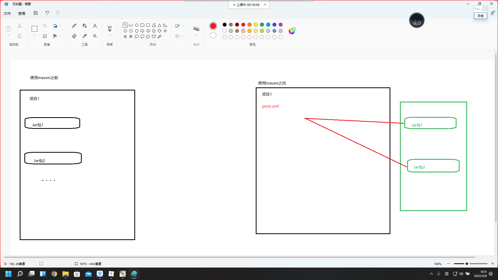
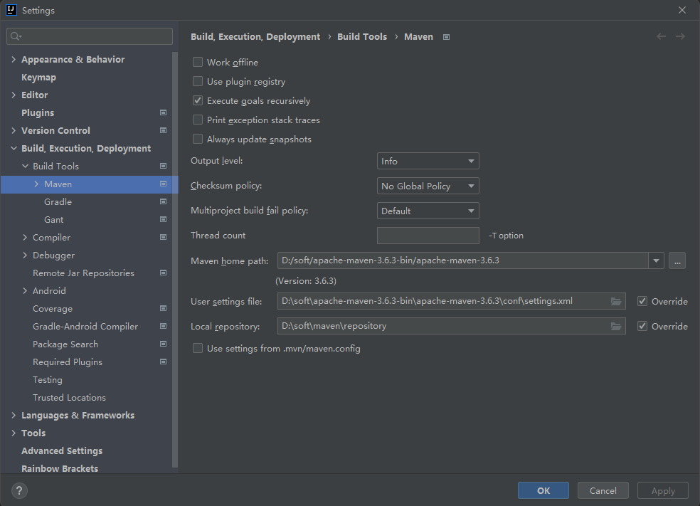
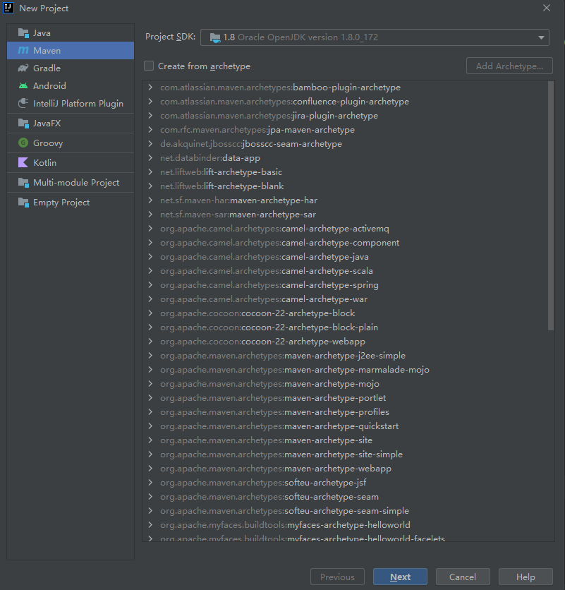
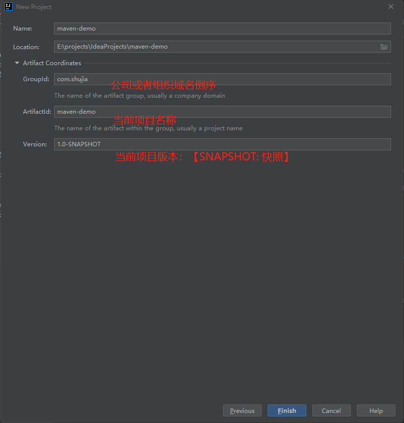
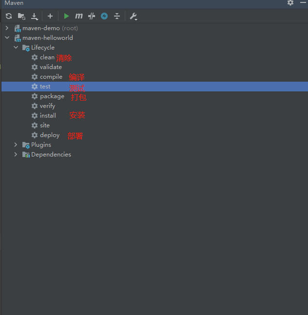

# Maven学习

> 今天我们就来学习一下maven，怎么说呢，maven更像是一种管理的工具，实现的原理是使用插件。
>
> 举个例子，比如说，一个公司需要做一个项目，这个项目又分成了很多的模块，每个模块又分成了许多的业务等等，这些需要许许多多的小组进行进行，最后再进行整合。
>
> 那么，就有一个很大的问题，IT技术发展这么快的时代里，每个人使用的jar包版本，使用的软件版本，等等，如果不一样的话，就算单个小模块可以进行，一旦整合就会出现各种各样的问题，那么如何避免或者说，尽量的最大程度上减少这种情况发生呢？
>
> 那就要用到Maven了，它更像是每一个开发者从网上的一个中央仓库中获取到开发所指定需要的jar包，并且也可以把自己完成的项目打包成一个jar包发布到这个中央仓库中，供其他的模块开发人员使用，同时，项目经理等管理员，可以统一开发所需要的版本，最大程度上减少这种非技术问题的情况发生。

### 第一章 为什么使用Maven

- 获取jar包

  - 使用Maven之前，自行在网络中下载jar包，效率较低。如【谷歌、百度、CSDN....】
  - 使用Maven之后，统一在一个地址下载资源jar包【阿里云镜像服务器等...】

- 添加jar包

  - 使用Maven之前，将jar复制到项目工程中，jar包添加到项目中，相对浪费存储空间

  - 使用Maven之后，jar包统一存储Maven本地仓库，使用坐标方式将jar包从仓库引入到项目中

    

- 使用Maven便于解决jar包**冲突及依赖**问题

### 第二章 什么是Maven

- Maven字面意：专家、内行
- Maven是一款自动化构建工具，专注服务于Java平台的**项目构建**和**依赖管理**。
- 依赖管理：jar之间的依赖关系，jar包管理问题统称为依赖管理
- **项目构建**：项目构建不等同于项目创建
  - 项目构建是一个过程【7步骤组成】，项目创建是瞬间完成的
    1. 清理：mvn clean
    2. 编译：mvn compile
    3. 测试：mvn test
    4. 报告：
    5. 打包：mvn package
    6. 安装：mvn install
    7. 部署：

### 第三章  安装并配置maven环境

> - 下载地址：https://maven.apache.org/index.html
>
> > 3.6.3版本下载地址：https://archive.apache.org/dist/maven/maven-3/3.6.3/binaries/
>
> - Maven底层使用Java语言编写的，所以需要配置JAVA_HOME环境变量及Path
> - 将Maven解压**非中文无空格**目录下
> - 配置**MAVEN_HOME**环境变量及Path
> - 输入【cmd】,进入命令行窗口，输入**【mvn   -v】** ，检查Maven环境是否搭建成功

链接：https://pan.baidu.com/s/1mE8k22lwUQJAd-GbQ3zzAg
提取码：twj0


#### 2、配置环境变量

打开环境变量配置的界面，可以参考怎么安装jdk https://www.cnblogs.com/wyh-study/p/11794205.html (当然这里配置maven的前提是安装并配置了JDK)

新建


 接着，去path中添加配置**bin目录**


#### 3、用cmd命令行输入mvn -v看看有没有配置成功：（看到如下的界面就说明配置成功了）


#### 4、修改阿里云镜像

>打开之前下载的maven文件：找到settings.xml文件，编辑打开：


```html
</mirrors>
	<mirror>
		<id>alimaven</id>
		<mirrorOf>*</mirrorOf>
		<url>https://maven.aliyun.com/repository/central</url>
	</mirror>
</mirrors>
```

#### 5、新建jar包目录

> - Maven配置文件位置：maven根目录/conf/settings.xml
>
> - 设置本地仓库【默认：C:/用户家目录/.m2/repository】

自定义创建目录，把它当作我后面下载jar包的目标路径


#### 6、修改刚刚打开的settings.xml （这里就不给出代码了，每个人的自定义目录可能不一样）


### 第四章 Maven及Idea的相关应用

#### 4.1 将Maven整合到IDEA中



#### 4.2 在IDEA中新建Maven工程






### 第五章 Maven核心概念

#### 5.1 Maven的POM

- POM全称：Project Object Model【项目对象模型】，将项目封装为对象模型，便于使用Maven管理【构建】项目

- pom.xml常用标签

  ```xml
  <?xml version="1.0" encoding="UTF-8"?>
  <project xmlns="http://maven.apache.org/POM/4.0.0"
           xmlns:xsi="http://www.w3.org/2001/XMLSchema-instance"
           xsi:schemaLocation="http://maven.apache.org/POM/4.0.0 http://maven.apache.org/xsd/maven-4.0.0.xsd">
      <!--    设置父工程坐标-->
      <parent>
          <artifactId>maven-demo</artifactId>
          <groupId>com.shujia</groupId>
          <version>1.0-SNAPSHOT</version>
      </parent>
      <modelVersion>4.0.0</modelVersion>
  
      <artifactId>maven-helloworld</artifactId>
  
      <properties>
          <maven.compiler.source>8</maven.compiler.source>
          <maven.compiler.target>8</maven.compiler.target>
      </properties>
  
      <dependencies>
          <!-- https://mvnrepository.com/artifact/junit/junit -->
          <dependency>
              <groupId>junit</groupId>
              <artifactId>junit</artifactId>
              <version>4.12</version>
  	        <scope>test</scope>
          </dependency>
  
      </dependencies>
  
  </project>
  ```

#### 5.2 Maven约定的目录结构

- 项目名
  - src【书写java源代码】
    - main【书写java主程序代码】
      - java【书写java代码】
      - resources【书写配置文件代码】
    - test【书写测试代码】
      - java【书写测试java代码】
  - pom.xml【书写配置文件代码】
  - target【编译后目录结构】

#### 5.3 Maven生命周期

- Maven生命周期：按照顺序执行各个命令，Maven生命周期包含以下三个部分组成
  - Clean LifeCycle：在进行真正的构建之前进行一些清理工作。
  - **Default LifeCycle：构建的核心部分，编译，测试，打包，安装，部署等等。**
  - Site LifeCycle：生成项目报告，站点，发布站点。



#### 5.4 Maven插件和目标

- 插件：插件本质是由jar包和配置文件组成
- 目标：每个插件都能实现多个功能，每个功能就是一个插件目标。

#### 5.5 Maven的仓库【重要】

- 仓库分类
  - 本地仓库：为当前计算机提供maven服务
  - 远程仓库：为其他计算机也可以提供maven服务    
    - 私服：架设在当前局域网环境下，为当前局域网范围内的所有Maven工程服务。
    - 中央仓库：架设在Internet上，为全世界所有Maven工程服务。
    - 中央仓库的镜像：架设在各个大洲，为中央仓库分担流量。减轻中央仓库的压力，同时更快的响应用户请求。
- 仓库中的文件类型【jar包】
  - Maven的插件
  - 第三方框架或工具的jar包
  - 自己研发的项目或模块

#### 5.6 Maven的坐标【重要】

- **作用：使用坐标引入jar包**

- 坐标由**g-a-v**组成

  [1]**groupId**：公司或组织的域名倒序+当前项目名称

  [2]**artifactId**：当前项目的模块名称

  [3]**version**：当前模块的版本

- 注意

  - g-a-v：本地仓库jar包位置
  - a-v：jar包全名

- 坐标应用

  - **坐标参考网址：http://mvnrepository.com**

  - 语法，示例

    ```xml
    <dependencies>
        <!-- https://mvnrepository.com/artifact/junit/junit -->
        <dependency>
            <groupId>junit</groupId>
            <artifactId>junit</artifactId>
            <version>4.12</version>
    	    <scope>test</scope>
        </dependency>
    
        <!-- https://mvnrepository.com/artifact/mysql/mysql-connector-java -->
    	<dependency>
       	 	<groupId>mysql</groupId>
        	<artifactId>mysql-connector-java</artifactId>
        	<version>5.1.49</version>
    	</dependency>
    
    
        <!-- https://mvnrepository.com/artifact/redis.clients/jedis -->
    	<dependency>
        	<groupId>redis.clients</groupId>
        	<artifactId>jedis</artifactId>
        	<version>4.0.1</version>
    	</dependency>
    
    </dependencies>
    ```

### 第六章 Maven的依赖管理

#### 6.1 依赖范围

- 依赖语法：\<scope>
  - compile【默认值】：在main、test、Tomcat【服务器】下均有效。
  - test：只能在test目录下有效
    - junit
  - provided：在main、test下均有效，Tomcat【服务器】无效。
    - servlet-api

#### 6.2 依赖传递性

- **路径最短者有先【就近原则】**
- **先声明者优先**

- 注意：Maven可以自动解决jar包之间的依赖问题

### 第七章 Maven中统一管理版本号

- 语法

  ```xml
  <properties>
          <junit-version>4.12</junit-version>
  </properties>
  <dependencies>
          <!-- https://mvnrepository.com/artifact/junit/junit -->
          <dependency>
              <groupId>junit</groupId>
              <artifactId>junit</artifactId>
              <version>${junit-version}</version>
  <!--            <scope>test</scope>-->
          </dependency>
  </dependencies>
  ```

### 第八章 Maven的继承

#### 7.1 为什么需要继承

- 如子工程大部分都共同使用jar包，可以提取父工程中，使用【继承原理】在子工程中使用
- **父工程打包方式，必须是pom方式**

#### 7.2 Maven继承方式一

- 在父工程中的pom.xml中导入jar包，在子工程中统一使用。【所有子工程强制引入父工程jar包】

- 示例代码

  ```xml
  <packaging>pom</packaging>
  <dependencies>
          <dependency>
              <groupId>junit</groupId>
              <artifactId>junit</artifactId>
              <version>4.12</version>
              <scope>test</scope>
          </dependency>
      </dependencies>
  ```

#### 7.3 Maven继承方式二

- 在父工程中导入jar包【pom.xml】

  ```xml
  <packaging>pom</packaging>
  <dependencyManagement>
      <dependencies>
          <dependency>
              <groupId>junit</groupId>
              <artifactId>junit</artifactId>
              <version>4.12</version>
              <scope>test</scope>
          </dependency>
      </dependencies>
  </dependencyManagement>
  ```

- 在子工程引入父工程的相关jar包

  ```xml
  <parent>
      <artifactId>maven_demo</artifactId>
      <groupId>com.atguigu</groupId>
      <version>1.0-SNAPSHOT</version>
      <relativePath>../pom.xml</relativePath>
  </parent>
   <dependencies>
          <dependency>
              <groupId>junit</groupId>
              <artifactId>junit</artifactId>
          </dependency>
  </dependencies>
  ```

- **注意：在子工程中，不能指定版本号**

### 第九章 Maven的聚合

- 为什么使用Maven的聚合

  - 优势：只要将子工程聚合到父工程中，就可以实现效果：安装或清除父工程时，子工程会进行同步操作。
  - 注意：Maven会按照依赖顺序自动安装子工程

- 语法

  ```xml
  <modules>
      <module>maven_helloworld</module>
      <module>HelloFriend</module>
      <module>MakeFriend</module>
  </modules>
  ```


